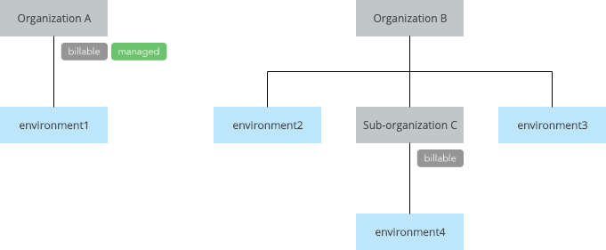

# Use cases: Advanced

The following are use cases to illustrate the flexibility of CloudMC roles with real-world examples.  Unless otherwise indicated, the examples assume an account that has a primary role of *Guest*, no additional roles,  *Viewer* access on at least one environment in the organization, and that the account is created in the organization intended to be accessed.  These are examples only, individual needs will vary.

The diagram below depicts two hypothetical organizations with environments and a sub-organization.  Note that Organization A has two tags, **billable** and **managed**, and Sub-organization C has one tag, **billable**.

| Scenario | Suggested role name | Role configuration | Notes from example |
| --- | --- | --- | --- |
| View usage information for organizations that are tagged as billable | Finance Administrator | Additional custom role with the *Usage: View* permission and scoped to **All organizations with a specific tag**, and specify the tag **billable**  | If the **billable** tag is removed from Organization A, this user will lose view access to the usage data for that organization |
| Manage all environments in an organization, but not the organization itself | Environment Administrator | Primary role *User*, additional custom role with all Administrator privileges except *Organizations:Manage* and *Roles:Manage*, scoped to the organization | Applied to a user in Organization B, full access would be granted to environment2 and environment3, and no access to environment4 |
| Administrator of one organization and all of its sub-organizations | Sub-org Administrator | Primary role *Administrator*, with an additional role of *Administrator* with a scope of **Specific organization and subs**, and specify the organization | Applied to a user in Organization B, full access would be granted to both Organization B and Sub-organization C |
| Manage all environments and sub-organizations across multiple organizations | Managed Services Administrator | Additional role of Administrator, scoped to **All organizations with a specific tag**, and specify **managed**.  Tag the relevant customer organizations with the tag **managed**. | Applied to a user in any organization, this gives *Administrator* access to all organizations tagged **managed**.  If the **managed* tag is removed from Organization A, access to that organization is lost automatically.  If the **managed** tag is added to Organization B, this access will be granted to that organization, and no access to Sub-organization C |
| *Editor*-level access to an environment for a user outside of the organization |  Not applicable | In the *Edit environment* page, check the *Allow external members* box, then go to *Manage members* and type the user's name in the search box.  Users from outside the organization appear in the section of the results titled *Users from other organizations*.  Select the user and apply the **Editor** role | On environment2, adding a member from Organization A will give the user access to environment2 |
